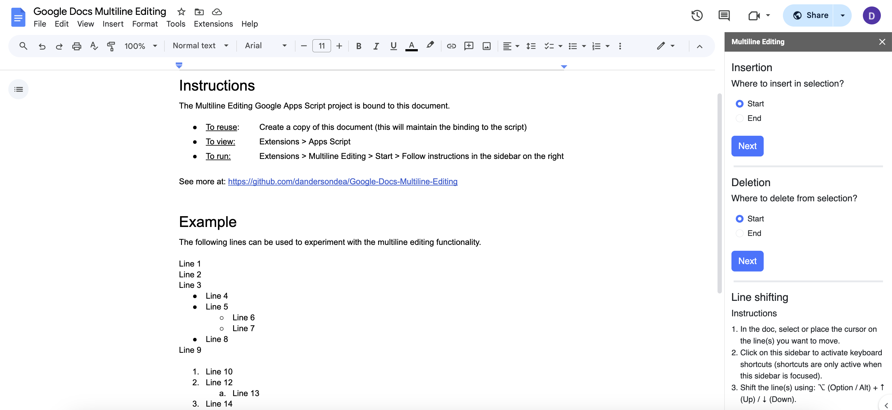

# Google Docs Multiline Editing Add-on

## Introduction

**A Google Docs add-on that enables multiline editing in the spirit of what's available in text editors like VS Code and Sublime.**

The goal is to enable faster editing of Google Docs. Yet while the add-on works, its practical usability is limited by lag and clunky UX flows that require use of the mouse (instead of just the keyboard). These limitations are due to restrictions within the Google Docs environment and are unlikely to be overcome with a non-native implementation such as this one.

While the usefulness of this add-on does not live up to hopes, it is nevertheless a successful exploration of the potential for multiline editing functionality implemented using [Google Apps Script](https://developers.google.com/apps-script).

*Caveat: This is a final project for [Harvard's CS50](https://cs50.harvard.edu/x/2025/project/) written by someone who is learning web programming. While I believe the limitations I encountered will beleaguer similar efforts, I'd love to be proven wrong (or for this functionality to get implemented natively within Google Docs).*

*[Link to the gDoc shown above](https://docs.google.com/document/d/1p-1fHHvow3aD0_4Jq-vZE6bbNzb9qoogHgYHnvaOMGk/edit?usp=sharing)*

### Features

1. **Insert** text at the start or end of selected line(s).
2. **Delete** characters from the start or end of selected line(s).
3. **Shift** a line or selection up or down in the document using the keyboard.

*Visual demo: [YouTube](https://youtu.be/937-p5RZtqY)*

### Use

1. Create a copy of [this Google Doc](https://docs.google.com/document/d/1p-1fHHvow3aD0_4Jq-vZE6bbNzb9qoogHgYHnvaOMGk/edit?usp=sharing), to which the Google Apps Script project is bound.
2. Start the add-on by clicking 'Extensions > Multiline Editing > Start' in the Google Docs menu bar.
3. Follow the instructions below to use each of the three features.

#### Multiline insert

*To insert text across multiple lines:*

1. In your document, select any # of lines.
    1. Selected lines do not need to be contiguous.
    2. Noncontiguous lines can be selected using the mouse by holding Command (⌘), or using the keyboard by holding Command (⌘) + Control (^) + Shift (⇧) in combination with the arrow keys ([Google Docs Editors Help](https://support.google.com/docs/thread/165128966/docs-new-feature-multiple-text-selection?hl=en)).
2. In the sidebar:
    1. Choose whether you want to insert text at the start or end of the lines, then click 'Next'.
    2. Input the text you want to insert, then click 'Insert'.

#### Multiline delete

*To delete text across multiple lines:*

1. Select any # of lines in your document, following the instructions under 'Multiline insert' above.
2. In the sidebar:
    1. Choose whether you want to delete text at the start or end of the lines, then click 'Next'.
    2. Select how many characters you want to delete, then click 'Delete'.

#### Line shifting

*To shift lines up or down:*

1. In your document, select any # of lines.
    1. Select lines must be contiguous.
2. Click on the sidebar to focus it.
3. While focused on the sidebar, hold Alt / Option (⌥) while pressing either the Up (↑) or Down (↓) arrow key.
    1. One press of the arrow key shifts the line(s) one place.

#### More

*To view the Apps Script `.gs` and `.html` files themselves:*

1. Click 'Extensions > Apps Script' in the Google Docs menu bar to open the Apps Script project, or
2. See [this GitHub repo](https://github.com/dandersondea/Google-Docs-Multiline-Editing) to which the project is synced.
    1. The link to the above GitHub repo can also be found by clicking 'Extensions > Multiline Editing > Help' in the Google Docs menu bar and then following the `README.md` link therein contained.

## Design details

### Current implementation

The add-on works by reading a selection object (fallback to cursor if no selection) from Google Docs. Then:

1. *For multiline insert / delete:*

    1. The user's insert / delete request is sent to the server for processing.
    2. The server then updates the text of the element(s) contained in the selection.

2. *For line shifting:*

    1. The user's line shifting request is sent to the server for processing, at which point the server repeatedly swaps the element(s) in the selection with their neighbors in the desired direction.
        1. Currently only TEXT, PARAGRAPH, and LIST_ITEM elements are supported.
    2. In the case when multiple line shifting requests are entered while one is being processed, the requests are debounced and batched on the client.
        1. Once the running request succeeds, the batched requests are sent to the server as a single request to shift the selected element(s) multiple steps at once.
    3. After swapping, the document's selection is reset to the new position of the initially-selected elements (or in the case of a cursor, to the original position within the target line).

### Limitations

Under the current implementation the usability of this add-on is limited by restrictions within the Google Docs environment that lead to the following limitations:

1. *For multiline insert / delete:*
    1. Editing can only be done at the start and end of lines, meaning one cannot access the middle a multiline selection or edit dynamically using multiple cursors.

2. *For line shifting:*
    1. Execution speed is dependent on the high-latency [google.script.run](https://developers.google.com/apps-script/guides/html/reference/run) API, meaning copy/paste might be a faster way to shift lines.
    2. The keyboard shortcuts are only active when the add-on's sidebar is focused, meaning moving lines requires the mouse to be used to shift focus back-and-forth between the main document and the add-on's sidebar.
    3. Selected lines must be contiguous and of type TEXT, PARAGRAPH, or LIST_ITEM in order to be shifted.

### Ideal implementation

The above limitations could potentially be overcome if the following ideal design was not prevented by restrictions within the Google Docs environment:

1. *For multiline insert / delete,* the ideal design would be to:

    1. Initialize multiple cursors that allow a user to dynamically edit multiple lines simultaneously, directly in the document.
        1. Multiple cursors however are not supported by Google Docs.

2. *For line shifting,* the ideal design would be to:

    1. Enable low-latency editing by using client-side JavaScript to update the document and then asynchronously sync the changes to the server.
        1. For security and integrity reasons however, Google Docs does not expose its DOM to the browser, meaning all edits must be passed through the `google.script.run` API and processed on the server. This leads to meaningful lag between the time a user submits a line shift request and when the document gets updated.
        2. Due to this lag, the following were not implemented:
            1. Support for holding down the arrow keys to continuously shift lines.
                1. The lag made it too difficult to tell how many requests were being submitted when the key was held down.
            2. Support for moving elements other than TEXT, PARAGRAPH, and LIST_ITEM (*e.g.* images and tables).
                1. The current usability of the feature did not seem worth extending the # of supported element types.
    2. Allow the user to trigger the line shifting procedure while focused on the document, without having to shift the browser's focus over to the sidebar.
        1. Google Docs restricts JavaScript execution in the main document, meaning script-based keyboard listeners only work inside the sidebar or modal in which they're defined.
        2. Workarounds potentially exist but were deemed not meaningfully impactful to explore given the more-pressing limitations described above. For reference the potential workarounds are:
            1. Place the line shifting function under a custom menu and then use Google's built-in menu shortcuts to connect them to the keyboard (Mac: Option (⌥) + Command (⌘) + M, then assigned letter).
            2. Create a Chrome Extension and then register global keyboard shortcuts at [chrome://extensions/shortcuts](chrome://extensions/shortcuts) to call the Google Apps Script functions via `chrome.runtime.sendMessage()`.

## File structure

The following is an explanation of the add-on's various files and the folders in which they're contained.

### backend/

Server-side scripts written using JavaScript-like Google Apps Script.

#### `controller.gs`

1. Upon opening the bound Google Doc, adds the 'Multiline Editing' add-on to the document's 'Extensions' menu.
2. Defines functions for rendering the sidebar and help modal HTML in the Google Doc, as well as linking in the features' JavaScript.

#### `input_deletion.gs`

1. Validates the user's selection and multiline insert / delete input.
2. Reads the selected line(s) from the document and inserts / deletes the requested text.

#### `line_switching.gs`

1. Validates the user's selection and line shift input.
2. Reads the selected line(s) from the document and repeatedly swaps them with their neighbors until they have been shifted the requested # of lines.
3. After swapping elements, resets the document's selection (or cursor) to the new location of the original line(s).

### javascript/

JavaScript code wrapped in HTML files to be loaded by `sidebar.html` (Google Apps Script projects do not support `.js` files).

#### `input_deletion.html`

1. Defines the dynamic UI logic behind the 'Insertion' and 'Deletion' sections of the Multiline Editing sidebar.
2. Validates and then passes input to `input_deletion.gs` upon click of the 'Insert' and 'Delete' buttons.

#### `line_switching.html`

1. Establishes keyboard listeners that trigger `line_switching.gs` when Alt / Option (⌥) + Up (↑) / Down (↓) are clicked.
2. Debounces line shifting requests and, while a request is running, batches subsequent requests into a single call to be run upon successful completion of the running request.

### ui/

HTML files that define the visual structure of the add-on's UI.

#### `sidebar.html`

1. Structures the Multiline Editing sidebar.

#### `help_modal.html`

1. Structures the help modal that links to this `README.md` on GitHub to provide users with more information.

## Possible next steps

*In addition to the ideas described under 'Ideal implementation' above...*

### All features

1. Explore ways to reduce mouse usage by establishing keyboard shortcuts for:
    1. Opening the multiline editing sidebar, and
    2. Changing the browser's focus from the document to the sidebar and back (for moving lines).
2. Add support for Windows keyboard shortcuts.

### Feature: Multiline insert

1. Add an option for parsing escape characters (which are currently interpreted as literal text).

### Feature: Line shifting

*If lag can be reduced to make the feature more usable:*

1. Use intervals to allow line(s) to be continuously shifted by holding down the relevant keys (rather than just repeatedly pressing them).
2. Support moving elements beyond TEXT, PARAGRAPH, and LIST_ITEM (*e.g.* images and tables).
3. Enable moving noncontiguous selections by reworking how `anchorSwapIndex` is defined in `line_switching.gs`.
